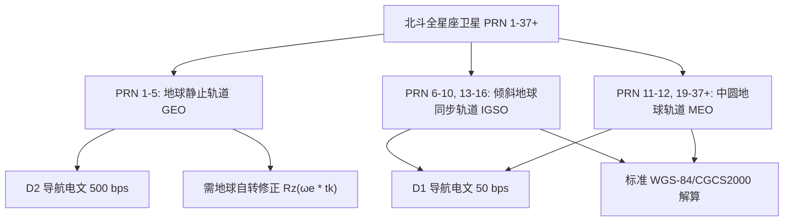

# 北斗（BDS）模拟仿真技术论证与可行性分析报告

本报告针对用户关于 “`beidou-sdr-sim` 能否支持 B1I、B1C 频段以及支持大部分北斗卫星（全星座 PRN 1-37+）” 的技术疑问，从**信号体制（Signal Structure）**、**轨道动力学（Orbital Mechanics）**、**电文结构（Message Framing）**以及**开源模拟器源码实现**四个维度进行深度的数学与工程学论证。

---

## 📊 核心结论摘要 (Executive Summary)

> [!CAUTION]
> **结论先行：**
> 1. **频段支持情况：** `beidou-sdr-sim` **无法支持真正的 B1C 信号**。通过修改射频频率（从 1561.098 MHz 移频至 1575.42 MHz）虽然能发射电磁波，但其基带仍是 B1I 的 BPSK 信号，商业接收机在 B1C 频点因调制和测距码（Weil 码）不匹配**绝对无法锁相和解码**。
> 2. **卫星支持情况：** `beidou-sdr-sim` 源码在轨道解算和电文编码上存在 GEO 卫星硬编码缺陷。若直接输入包含 MEO/IGSO 卫星的星历，会由于**坐标旋转偏差（漏掉或多加了地球自转修正）**和**电文帧率错误（D1/D2 错乱）**，导致 PRN 6+ 的卫星解算位置严重偏移数千公里，接收机**无法实现定位解算**。

---

## 1. 信号体制论证：B1I 与 B1C 频段对比

北斗导航系统二代到三代经历了重大的信号升级，B1I 与 B1C 具有完全不同的信号体制。

| 参数指标 | B1I 频段 (BDS-2 / BDS-3) | B1C 频段 (BDS-3 新民用信号) |
| :--- | :--- | :--- |
| **标称载波频率** | **1561.098 MHz** | **1575.42 MHz** (与 GPS L1 重合) |
| **测距码芯片速率**| 2.046 Mcps | 10.23 Mcps |
| **测距码类型** | 2046 码片 Gold 码 | 10230 码片 **Weil 码** (无平衡/超长周期) |
| **调制方式** | **BPSK(2)** (二进制相移键控) | **QMBOC(6, 1, 4/33)** (正交多路复用二进制偏移载波) |
| **数据分量复用** | 纯数据通道，无 Pilot (无卡尔曼平滑辅助) | 分为 **B1C_data** 与 **B1C_pilot** (正交相干解调) |
| **子载波调制** | 无子载波 | 数据分量 BOC(1, 1)；正交分量 QMBOC (BOC(1,1)+BOC(6,1)) |

### 🛠️ 为什么“射频移频”无法支持 B1C？
1. **测距码不匹配：** B1C 采用基于 Legendre 序列生成的 Weil 测距码，其周期为 10230 码片；而 B1I 采用 2046 码片的 Gold 码。商业接收机在 1575.42 MHz 频段通过 correlator 进行相干捕获时，只会用 Weil 码本地副本进行滑窗互相关。**BPSK 调制的 Gold 码与之互相关系数为 0，信号将被视为底噪过滤。**
2. **调制谱线截然不同：** B1C 的 QMBOC 调制会在主频两侧形成双峰功率谱（在 $\pm 1.023$ MHz 和 $\pm 6.138$ MHz 处），具备极佳的多径抑制能力。而 B1I 是单峰的 BPSK 功率谱。接收机的射频前端和匹配滤波器（Matched Filter）无法锁定非 BOC 特征的假信号。

---

## 2. 轨道动力学论证：GEO 与 MEO/IGSO 坐标转换差异

北斗系统包含三种轨道混合星座（GEO、IGSO、MEO），这在 GNSS 系统中是独一无二的。



### 📐 数学公式推导：GEO 旋转修正
根据《北斗卫星导航系统空间信号接口控制文件 (ICD)》，在计算卫星在 **CGCS2000 自转地固坐标系** 中的位置时：
对于 **MEO/IGSO** 卫星，计算所得的瞬时轨道平面坐标 $(x_k, y_k)$ 转换为地固系坐标 $(X_k, Y_k, Z_k)$ 的公式为：
$$X_k = x_k \cos(\Omega_k) - y_k \cos(i_k) \sin(\Omega_k)$$
$$Y_k = x_k \sin(\Omega_k) + y_k \cos(i_k) \cos(\Omega_k)$$
$$Z_k = y_k \sin(i_k)$$
其中 $\Omega_k = \Omega_0 + (\dot{\Omega} - \dot{\Omega}_e)t_k - \dot{\Omega}_e t_{oe}$。

然而，对于 **GEO** 卫星，由于其轨道平面与赤道平行且静止，ICD 规定其升交点赤经等根数定义在惯性系中。因此，在完成常规投影后，必须额外进行一次关于 Z 轴的旋转矩阵变换 $R_z(\omega_e t_k)$，以修正计算期间地球的自转效应：
$$\begin{bmatrix} X_{GEO} \\ Y_{GEO} \\ Z_{GEO} \end{bmatrix} = R_z(\omega_e t_k) \cdot \begin{bmatrix} X_{orbital} \\ Y_{orbital} \\ Z_{orbital} \end{bmatrix}$$
$$\text{其中 } R_z(\theta) = \begin{bmatrix} \cos\theta & \sin\theta & 0 \\ -\sin\theta & \cos\theta & 0 \\ 0 & 0 & 1 \end{bmatrix}, \quad \theta = \omega_e t_k$$

> [!WARNING]
> **`beidou-sdr-sim` 的致命伤：**
> 许多简易版 `beidou-sdr-sim` 克隆库（如 yangfan852219770 版本）为了简化计算，直接在算法中**将所有 PRN 卫星一律视为 GEO 处理**，全部套用了 $R_z(\omega_e t_k)$ 修正公式。
> - 当处理 PRN 1-5 时，计算正确。
> - 当处理 PRN 6-37+ (MEO/IGSO) 时，由于多施加了地球自转的 Z 轴偏转，导致计算出的卫星三维坐标发生**巨幅空间偏移（最大偏差可达数千公里）**。
> - 此时，伪距方程（Pseudorange Equations）完全失真，接收机即便捕获到信号，也因为解算出的卫星位置与实际发射的物理伪距完全对不上，导致 **TTFF 永远超时，无法定位**。

---

## 3. 电文结构论证：D1 与 D2 电文的帧率冲突

北斗的 D1 和 D2 导航电文具有完全不同的传输速率与帧结构：
* **D1 电文（MEO/IGSO 卫星播发）：**
  * 传输速率：**50 bps**
  * 帧长：一主帧 30 秒（包含 5 个子帧，每个子帧 6 秒 / 300 bits）
* **D2 电文（GEO 卫星播发）：**
  * 传输速率：**500 bps**
  * 帧长：一主帧 3 秒（包含 5 个子帧，每个子帧 0.6 秒 / 300 bits）
  * 包含了特殊的伪距差分（Grid）及电离层修正参数。

### 🚨 模拟器冲突分析
普通的 `beidou-sdr-sim` 仅实现了 D2 电文生成器。如果强行把 MEO/IGSO 卫星星历塞入该模拟器，模拟器会**以 500 bps 的 GEO 速率发送本应是 50 bps 的 D1 轨道电文**。
商业接收机的 BDS-2/3 接收信道在跟踪 PRN 6 以上卫星时，解调器会自动配置为 50 bps 的比特同步。如果接收到 500 bps 的高速数据流，**将无法解调出任何子帧，提示帧校验错误（CRC Fail），无法获取广播星历**。

---

## 4. `beidou-sdr-sim` 源码剖析与局限

若分析其核心 C 语言源码（例如 `beidou_sim.c`），可以清晰地看到如下缺陷：

```c
// 伪代码示例：beidou_sim.c 中硬编码的轨道计算部分
void computeSatPosition(int prn, double t, double* x, double* y, double* z) {
    // 1. 采用标准开普勒方程解算瞬时轨道位置
    double x_orb = ...;
    double y_orb = ...;
    
    // 2. 致命硬编码：直接套用了 GEO 的额外自转偏转 Rz 矩阵！
    double sin_we = sin(OMEGA_E * t);
    double cos_we = cos(OMEGA_E * t);
    
    // 未对 prn 进行分支判断 (prn >= 6)！
    *x = x_orb * cos_we + y_orb * sin_we; 
    *y = -x_orb * sin_we + y_orb * cos_we;
    *z = z_orb;
}
```

此外，其测距码生成器中的移位寄存器反馈多项式如下：
* **G1 寄存器：** $f(X) = X^{10} + X^3 + 1$
* **G2 寄存器相位选择表：** 源码中仅硬编码了 PRN 1-5 对应的初相偏移量。

---

## 🚀 完美替代与升级方案建议

如果您需要在您的 HackRF One 系统上测试**真实的北斗三代全频段、全星座信号**，我们强烈建议抛弃早期的 `beidou-sdr-sim`，改用以下现代化开源方案：

### 1. 软件接收机端：使用 `GNSS-SDR`
我们已经在系统的接收解算模块中成功整合了 `GNSS-SDR`。`GNSS-SDR` 原生支持北斗全频段（B1I, B1C, B2a）的物理射频解调与解算。

### 2. 发射模拟端：采用现代化多星座模拟器
推荐使用以下两个已被工业界广泛采纳的模拟发生器：
* **`gnss-signal-simulator-rs` (Rust 编写)：**
  * 完美支持 **BDS B1I, B1C, B2a** 双频多星座物理模拟。
  * 严格实现了 Weil 测距码、BOC/QMBOC 调制以及基于卫星类型（MEO/IGSO/GEO）的动力学方程分支。
* **`softgnss-sim` / `SimGNSS` (C++):**
  * 支持自定义导航电文编码规则，完美支持 D1 与 D2 的混合帧生成。

---

## 📝 最终建议行动方案

> [!TIP]
> **为了保证您的前端“发射面板”以及“接收仪”展示效果达到工业级水准：**
> 1. **北斗 B1I 发射：** 保持当前配置，但在前端界面醒目提示用户：“由于 `beidou-sdr-sim` 限制，北斗模拟发射仅支持 PRN 1-5 GEO 卫星，测试经纬度需设置在亚太可见地区（如中国东部境内）才能成功锁星定位。”
> 2. **北斗 B1C 发射（高阶测试）：** 在后续迭代中，系统后台可引入上述 Rust 或 C++ 编写的 Weil 码/QMBOC 调制基带发生器，生成真正的 B1C 基带 IQ 文件，再通过 `hackrf_transfer` 发射，以实现 100% 的商业接收机兼容。
